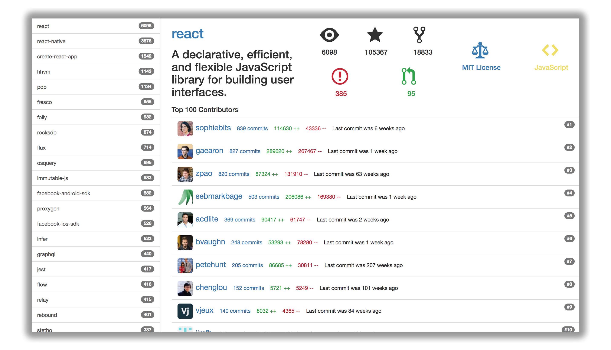

# Organization Projects

A minimal React & Redux app to show the repositories of an organization on GitHub.

The default repositories being shown are from [Facebook](https://github.com/facebook).

<p align="center">
  
</p>

## What is this project for?
:unlock: This is an example application to showcase some of my practices with React and Redux development. If you have any suggestions or critics about some architectural design **#FeelFree** to open an [issue](https://github.com/caiocmpaes/organization-projects/issues). :thumbsup:

## Installation

### Download the repository and install dependencies
```bash
# Clone this repository
$ git clone https://github.com/caiocmpaes/organization-projects

# Go into the repository
$ cd organization-projects

# Install dependencies
$ npm install
```

### Create a Personal Access Token and set ENV value
- Create an access token [here](https://github.com/settings/tokens)
- Create a new file `.env` and set your Access Token there
```diff
GITHUB_OAUTH_TOKEN=Put_your_Personal_Access_Token_Here
```
The token is required to perform requests to GitHub APIs.

## Usage

Run the project
```bash
# Run the app
$ npm run local
```
Open your browser at http://localhost:5000

Click on any repository on the left sidebar and see details on the right.

## Features
- Repositories ordered by `watchers`
- Repository details:
  - Name with link & Description
  - Watchers, Stars, and Forks
  - Open Issues and Open Pull Requests
  - License with link
  - The primary language of the project
- List TOP 100 contributors
  - All the same info of [contributors page](https://github.com/facebook/react/graphs/contributors)
  - Last commit approximate date by contributor

## TODOs
- [ ] Add tests :see_no_evil:
- [ ] React to `Error` actions like `SHOW_REPOSITORY_CONTRIBUTORS_ERROR`
- [ ] Deploy Serverless service to AWS
- [ ] Add search box above sidebar to allow search for other organizations projects

## License
[MIT](https://choosealicense.com/licenses/mit/)